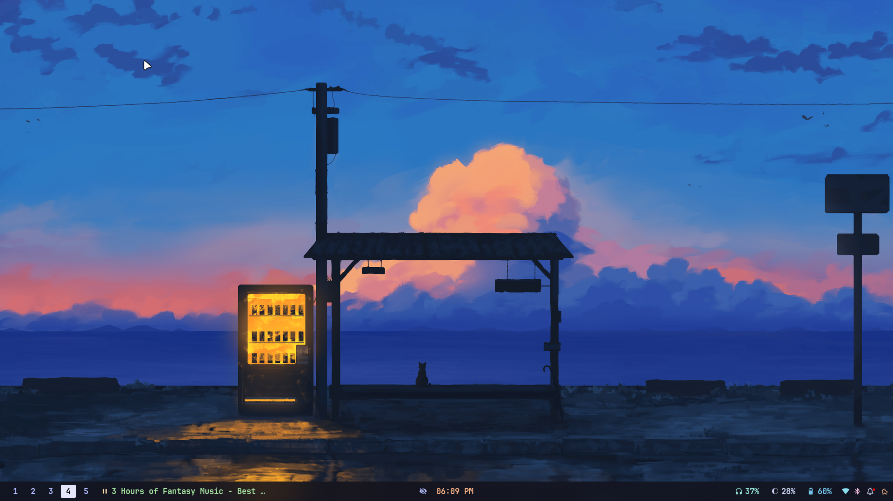
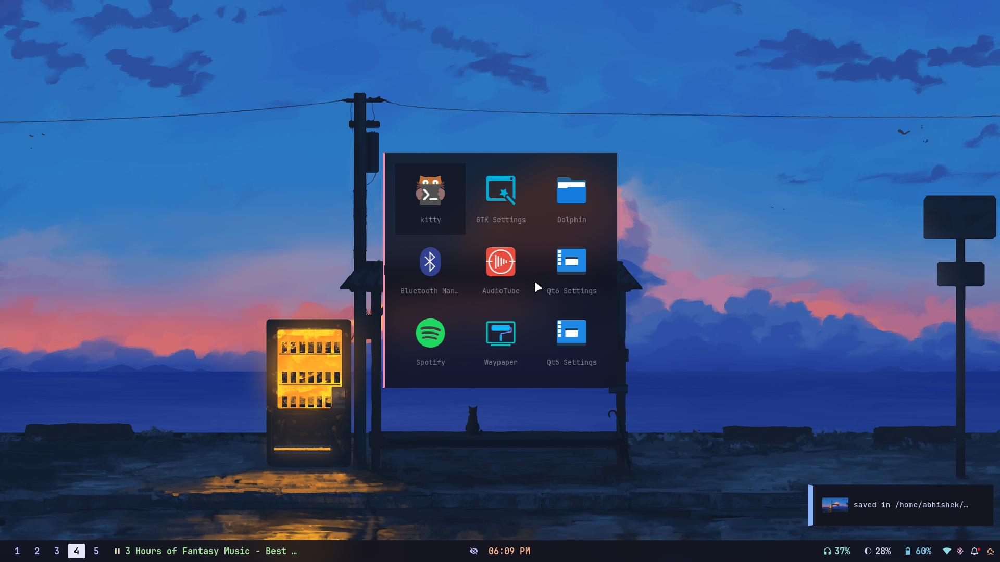
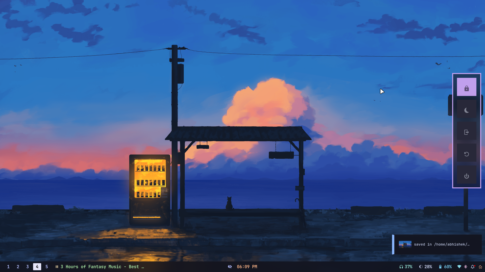
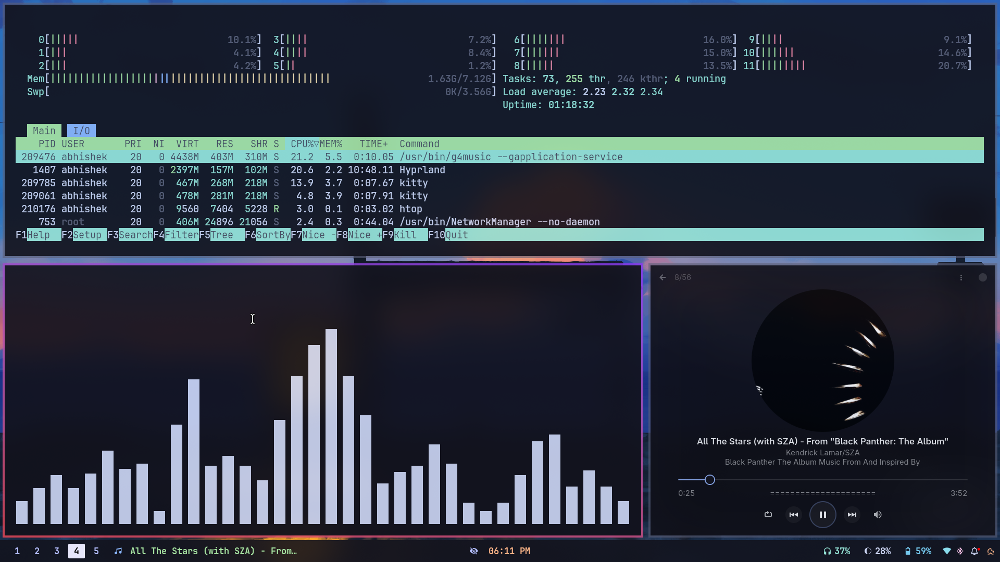
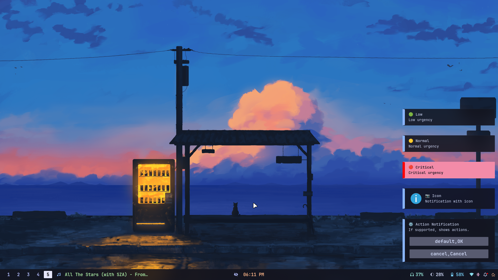
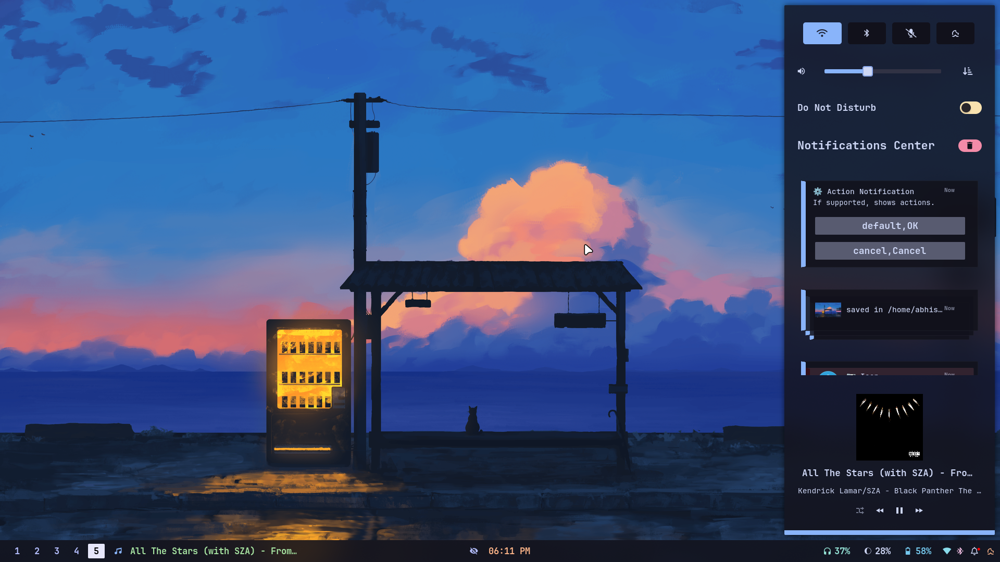
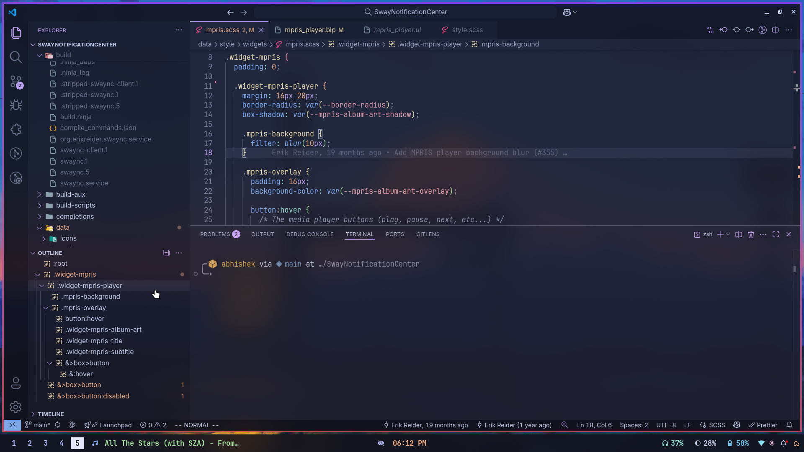
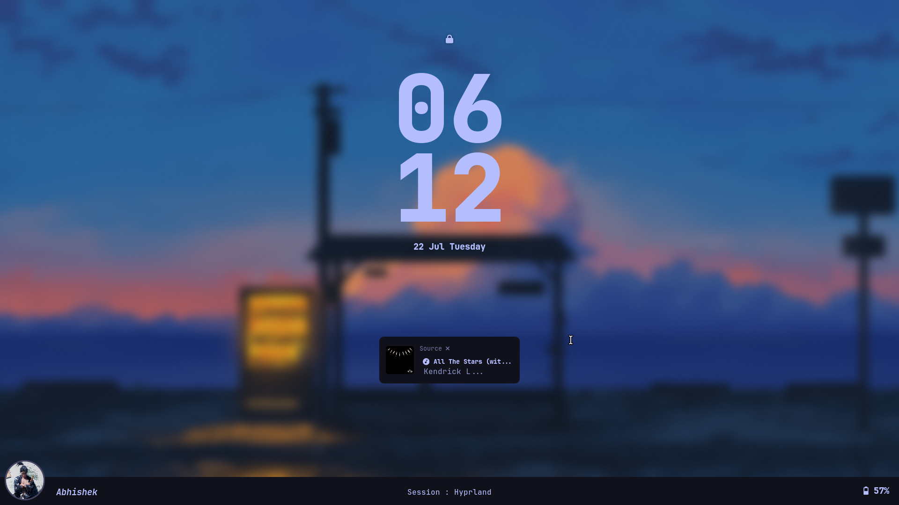

# 🌊 NamiConfig 2.0

<div align="center">


<h2>🚀 Modern, Modular & Polished Dotfiles for Arch + Hyprland</h2>

<p>
  <b>Unified theming</b> · <b>Consistent UI/UX</b> · <b>One-click 🌗 Light/Dark toggle</b> <br>
  <b>Powered by <a href="https://www.gnu.org/software/stow/">GNU Stow</a></b>
</p>

</div>

---

A modular dotfiles system built for **Arch Linux + Hyprland**, featuring unified theming, consistent UI/UX, and one-click light/dark toggle support. Managed cleanly using **[GNU Stow](https://www.gnu.org/software/stow/)**.

This rice was built **completely from scratch** by me — no borrowing from others' dotfiles. It might be rough around the edges, but I finally understand every part of my setup. Feels good.

---

## 🛠️ SwayNC Customization

I customized **SwayNC** by editing the `.blp` layout file **directly in the source code**, then rebuilding it with **Meson + Ninja**. This gave me full control over its layout and visuals — something not possible through CSS alone.

---

## 📦 Structure (Stow-compatible)

```

.
├── .config/
│   ├── bat/
│   ├── ags/
│   ├── cava/
│   ├── hypr/
│   ├── kitty/
│   ├── Kvantum/
│   ├── mako/
│   ├── NamiThemes/
│   ├── qt5ct/
│   ├── qt6ct/
│   ├── rofi/
│   ├── scripts/
│   ├── spicetify/
│   ├── swappy/
│   ├── swaync/
│   ├── waybar/
│   └── zathura/
├── .zshrc
└── README.md

```

Each folder is a **Stow package** you can symlink into your `$HOME`.

---

## 🧰 How to Use

### 🔹 Step 1: Clone the repo

```bash
git clone https://github.com/Itz-Abhishek-Tiwari/NamiConfig.git ~/.dotfiles
cd ~/.dotfiles
```

### 🔹 Step 2: Install stow

```bash
sudo pacman -S stow
```

### 🔹 Step 3: Stow your configs

```bash
stow .config/kitty
stow .config/waybar
stow .zshrc
```

Or stow everything:

```bash
stow .
```

---

## 🎨 Theme Toggle Script

Switch between **light** and **dark** mode across all supported apps:

```bash
~/.config/scripts/mode_toggle.py
```

✅ This affects:

- GTK 3/4 (via gsettings + config)
- Kitty, Waybar, Mako, Rofi
- VSCode (`settings.json`)
- Nemo (reloads if running)
- Sends themed notification

---

## 🌈 Themes & Styles

All theme variants are located in:

```
~/.config/NamiThemes/
```

Includes `light` and `dark` styles for:

- Kitty
- Waybar
- Rofi
- Mako
- SwayNC

These are auto-applied via the toggle script.

---

## 🖼 Wallpapers

Wallpapers used with `swww` live in:

```
~/.config/hypr/wall/
```

Hand-picked and themed to match the rice.

---

## 📸 Screenshots

<details>
<summary>🌑 Dark Mode — Click to expand</summary>

<br>










</details>

---

## ⚙️ Requirements

Make sure the following are installed:

- `hyprland`, `waybar`, `swaync`, `kitty`, `rofi`, `nemo`
- `bat`, `cava`, `swappy`, `spicetify`
- `python3`, `stow`
- A Nerd Font (e.g. `JetBrainsMono Nerd Font`)

---

## ✅ To-Do / Planned Features

- [ ] 💡 Theme Switcher GUI (via `rofi` or `fzf`)
- [ ] 🌄 Wall + Theme sync automation
- [ ] 🧩 Auto-apply VSCode theme via extensions
- [ ] 🖼 Live CLI preview (like `nvfetcher`)
- [ ] 📦 Bootstrap script to auto-stow everything
- [ ] 🔁 Dynamic terminal/GTK accent integration
- [ ] 🌐 Optional Git sync/backup integration

---

## 🙏 Credits

- [Catppuccin Theme](https://github.com/catppuccin)
- [adi1090x Rofi Scripts](https://github.com/adi1090x/rofi)
- [nwg-piotr Waybar Modules](https://github.com/nwg-piotr/waybar)
- Everyone on r/unixporn and the Arch Wiki ❤️

---

## 📜 License

MIT — use, fork, and modify freely.

